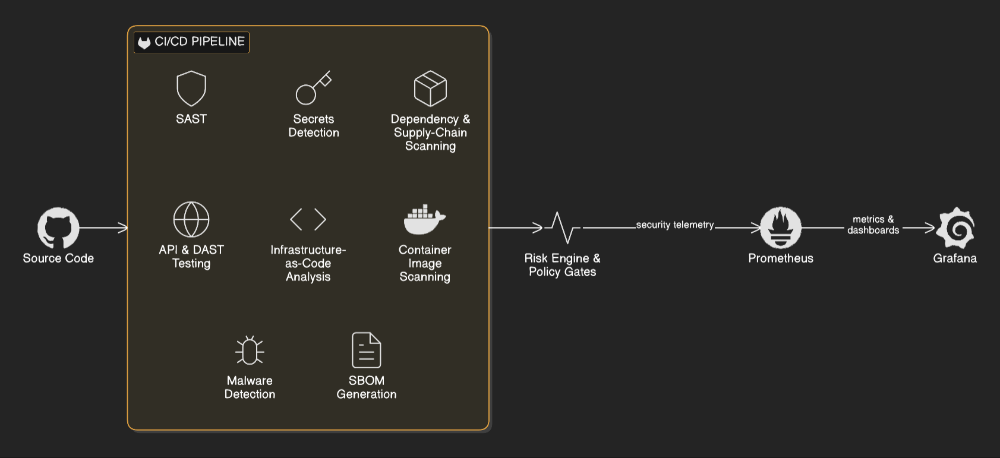
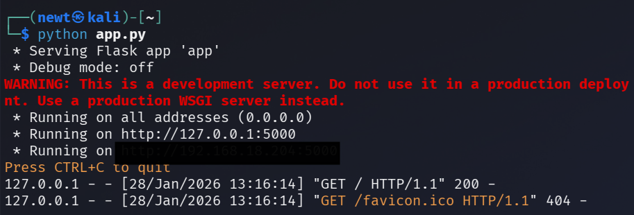
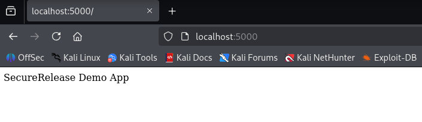
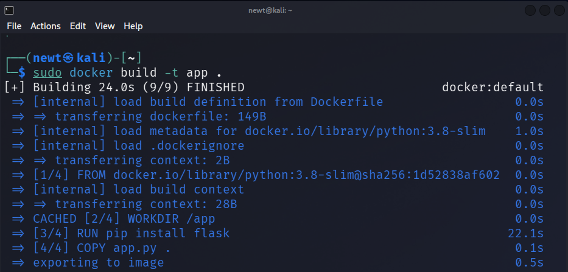
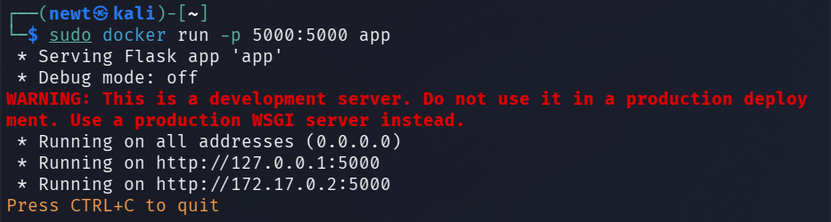
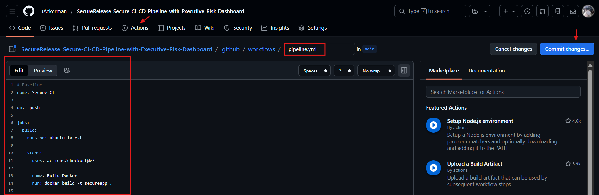
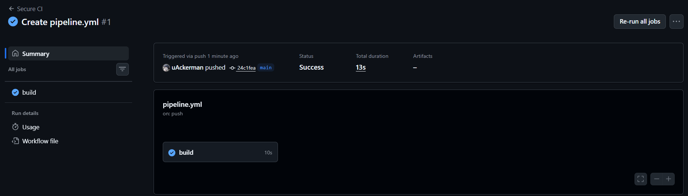
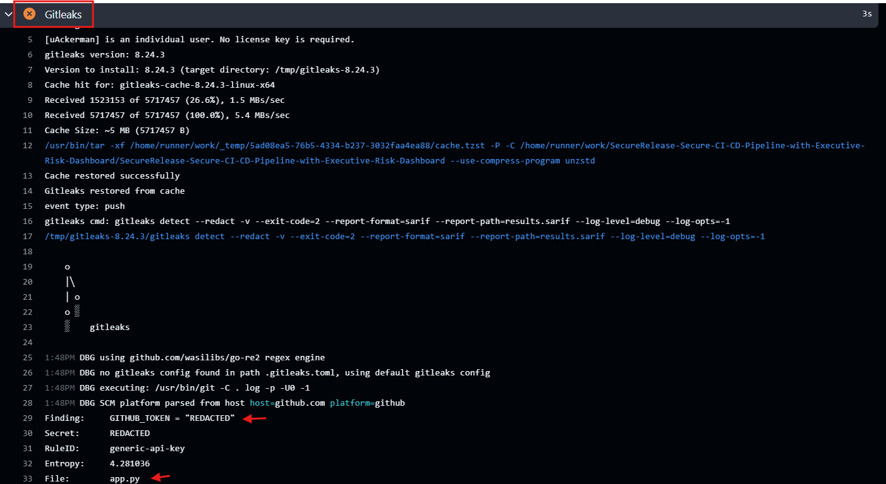

# SecureRelease-Secure-CI-CD-Pipeline-with-Executive-Risk-Dashboard
SecureRelease is a DevSecOps Risk Intelligence platform that embeds security into CI/CD Pipeline and converts technical vulnerabilities into business-level release risk. It integrates SAST, dependency, container, API, and cloud security with policy-driven release controls. Prometheus and Grafana expose real-time dashboards showing release safety.

**Author:** Uzair Khan 

***

   

***

# Tools & Services Used
- **GitHub Actions, Docker, Git** (CI/CD Pipeline)   
- **Semgrep, Gitleaks, Trivy, OWASP Dependency-Check** (Application & Code Security)
- **Prometheus, Grafana** (Monitoring Visibility)
- **Vulnerable Flask App**

# Workflow

## Creat Flask Application ( [app.py](https://github.com/uAckerman/SecureRelease-Secure-CI-CD-Pipeline-with-Executive-Risk-Dashboard/blob/main/app.py) )

At this stage, we create a simple Flask-based web application that will act as our demo service for the SecureRelease pipeline. The focus is on:

- Initializing a Flask server
- Setting up basic routing
- Connecting to a local SQLite database
- Preparing a structure that can be analyzed by security tools in later stages

***
 

***
 

***

## Dockerize the App ( [Dockerfile](https://github.com/uAckerman/SecureRelease-Secure-CI-CD-Pipeline-with-Executive-Risk-Dashboard/blob/main/Dockerfile) )

In this part, the Flask application is packaged into a Docker container so it can be run easily and consistently on any system. By running the app inside a container, deployment becomes simpler and more reliable. It removes dependency issues, keeps the environment consistent, and makes the application easier to move between systems.

***
 

***
 

***

## CI/CD Pipeline ( [pipeline.yml](https://github.com/uAckerman/SecureRelease_Secure-CI-CD-Pipeline-with-Executive-Risk-Dashboard/blob/main/.github/workflows/pipeline.yml) )
In this section, we set up a basic CI/CD pipeline using GitHub Actions to automatically build our application whenever code is pushed to the repository.

This pipeline performs the following:

1. Triggers automatically on every push
2. Uses an Ubuntu runner
3. Pulls the repository code
4. Before and After Build Security Checks 
5. Builds the Docker image for the application

***
 

***
 

***

## Add Security Scanners to Pipeline

Now I integrated automated security controls directly into the CI/CD pipeline to ensure vulnerabilities, misconfigurations, and secrets are detected early in the development lifecycle.

- Semgrep (**SAST**)
- OWASP ZAP (**DAST**)
- Dependency Check (**SCA**)
- Gitleaks (**Secrets Scan**)
- Checkov (**IaC Scan**)
- Trivy (**Container Scan**)

## Validating Security Scanners via Vulnerable Code
After integrating security scanners into the CI/CD pipeline, the next step is to **validate their effectiveness**. To do this, I intentionally introduced vulnerable patterns into the application (**app.py**) and pushed the changes to trigger the pipeline.

### 1. Secrets Scanning — Gitleaks 
Gitleaks scans the repository for hardcoded secrets, such as API keys, tokens, passwords, and credentials that should never be committed to source control.

> API_KEY = "HARDCODED_SECRET_123"

***
 

***

Scanned Report can be found here : **[Gitleak Report](https://github.com/uAckerman/SecureRelease-Secure-CI-CD-Pipeline-with-Executive-Risk-Dashboard/blob/main/Reports/Gitleak.txt)**
